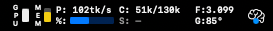
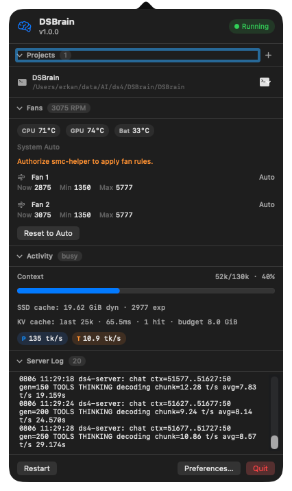
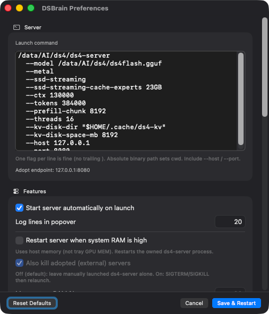
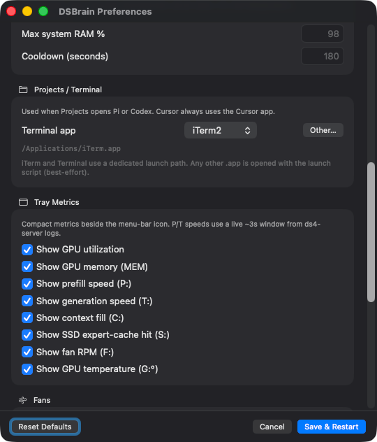
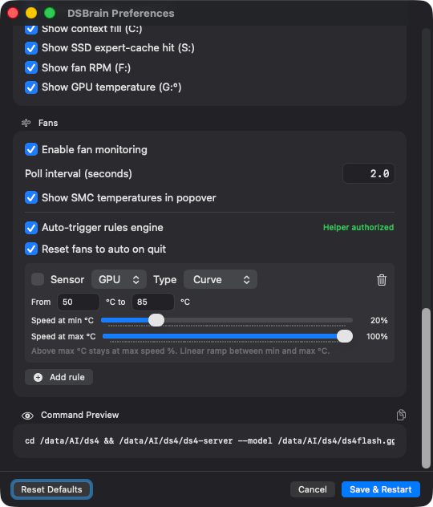

# DSBrain

macOS menu bar app that runs and monitors a local [ds4-server](https://github.com/antirez/ds4) (DeepSeek V4 / Flash) process — tray metrics, fan control, and one-click project launches into Pi, [OMP](https://github.com/can1357/oh-my-pi), Codex, or Cursor.

## Screenshots

### Menu bar

Compact tray metrics beside the brain icon (GPU/MEM, P/T speeds, context, SSD hit, fans, temps).



| Tray       | Meaning                                                                                             |
| ---------- | --------------------------------------------------------------------------------------------------- |
| **GPU**    | GPU utilization (vertical mini-bar)                                                                 |
| **MEM**    | GPU-mapped memory vs physical DRAM (fill); bar color is host memory pressure (green / yellow / red) |
| **P:**     | Prefill speed (tokens/s, ~3s rolling window from logs)                                              |
| **T:**     | Generation / decode speed (tokens/s); during prefill this slot shows **%:** progress instead        |
| **C:**     | Context fill — tokens used / context window                                                         |
| **S:**     | SSD streaming expert-cache hit rate (%)                                                             |
| **F:**     | Primary fan RPM                                                                                     |
| **G:**     | GPU temperature (°C)                                                                                |
| Brain icon | App glyph; colored badge = stopped / loading / ready / busy / error                                 |

### Popover

Projects, fans, activity (context / SSD / KV / P·T), server log, and lifecycle actions.



### Preferences

Launch command and server options:



Projects terminal + tray metric toggles:



Fan monitoring, rules, and command preview:



## Features

- Launch `ds4-server` via a configurable command (`bash -lc`; PATH name or absolute path)
- Adopt an already-running `ds4-server` on the configured `--host` / `--port`
  (or via `/tmp/ds4.lock` when the port is not bound yet)
- Status bar: activity badge, GPU/MEM mini-bars, P/T speeds, context (`C:`), SSD cache hit (`S:`), fan RPM / GPU temp
- Popover: Projects, Fans, Activity, Server Log, Start / Restart / Quit
- Projects: pin folders and open with [Pi](https://github.com/badlogic/pi-mono), [OMP](https://github.com/can1357/oh-my-pi) (`omp`), Codex CLI, or Cursor against the local OpenAI-compatible endpoint
- Preferences for launch command, tray toggles, memory watchdog, fan rules, terminal app
- Optional host-RAM watchdog that restarts the owned server when usage crosses a threshold
- Daily rotated logs under `~/Library/Application Support/DSBrain/`

## Prerequisites

- macOS 13+ (Ventura), Apple Silicon
- Xcode 15+ command line tools (or full Xcode) — only needed to build from source
- A built [`ds4-server`](https://github.com/antirez/ds4) binary and model GGUF on disk

## Install (Homebrew)

```bash
brew tap derkan/dsbrain https://github.com/derkan/dsbrain
brew trust derkan/dsbrain
brew install --cask dsbrain
```

Homebrew requires trusting third-party taps before loading their casks.

The cask is unsigned. If Gatekeeper blocks the app: right-click → **Open**, or `xattr -cr /Applications/DSBrain.app`.

## Quick start

```bash
git clone https://github.com/derkan/dsbrain.git
cd dsbrain
make run          # debug build + launch
make run-release  # release build + launch
```

1. Click the status item → **Preferences…**
2. Set `launch_command` (`ds4-server` on PATH, or an absolute path) and flags; include `--host` / `--port`
3. **Save & Restart**

## Makefile

```
make build / build-debug
make bundle / bundle-debug / bundle-release
make run / run-release
make release          # release .app + DSBrain-<ver>-macos-arm64.zip
make test
make clean
make resolve
make xcode
make icons
make format
make lint
make help
```

## Releases

Push a semver tag to cut a GitHub Release (Apple Silicon zip attached):

```bash
# bump CFBundleShortVersionString in DSBrain/Info.plist first
git tag -a v1.0.0 -m "v1.0.0"
git push origin v1.0.0
```

Local artifact only: `make release` (or `make release VERSION=1.0.0`).

The release workflow also bumps [`Casks/dsbrain.rb`](Casks/dsbrain.rb) on `main` so the Homebrew tap stays in sync.

The release zip is unsigned. After moving `DSBrain.app` to Applications, if Gatekeeper blocks it: right-click → **Open**, or:

```bash
xattr -cr /Applications/DSBrain.app
```

## Config

Created at `~/Library/Application Support/DSBrain/config.yaml` on first launch:

```yaml
server:
  launch_command: |
    ds4-server
      --model /path/to/ds4/ds4flash.gguf
      --metal
      --ssd-streaming
      --ssd-streaming-cache-experts 24GB
      --ctx 100000
      --tokens 384000
      --kv-disk-dir "$HOME/.cache/ds4-kv"
      --kv-disk-space-mb 8192
      --host 127.0.0.1
      --port 8080

max_lines: 20
auto_start: true
terminal_app: ""   # empty → iTerm if installed, else Terminal.app

memory_watchdog:
  enabled: false
  max_system_memory_percent: 90
  cooldown_sec: 180
  kill_adopted: false

tray:
  show_gpu: true
  show_gpu_mem: true
  show_prefill_tps: true
  show_gen_tps: true
  show_ctx: true
  show_ssd_hit: true
  show_fan_rpm: true
  show_gpu_temp: true

fans:
  enabled: true
  poll_interval_sec: 2
  show_temps_in_popover: true
  rules:
    enabled: false
    on_quit_reset: true
    items: []
```

Pinned projects live in a separate file: `~/Library/Application Support/DSBrain/projects.yaml`.

### Fan helper

Manual fan writes need the bundled setuid `smc-helper`. Use **Authorize** in the Fans section (or Preferences). Reads use in-process IOKit; writes invoke the helper. Fan control can affect thermals — use at your own risk.

## License

MIT — see [LICENSE](LICENSE).
